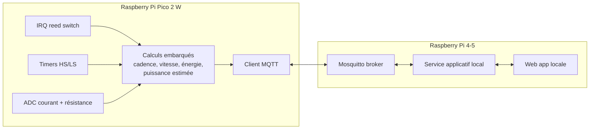

```mermaid
flowchart LR
subgraph Pico2W["Raspberry Pi Pico 2 W"]
A1[IRQ reed switch]
A2[Timers HS/LS]
A3[ADC courant + résistance]
A4[Calculs embarqués\ncadence, vitesse, énergie,\npuissance estimée]
A5[Client MQTT]
end

    subgraph Pi45["Raspberry Pi 4-5"]
        B1[Mosquitto broker]
        B2[Service applicatif local]
        B3[Web app locale]
    end

    A1 --> A4
    A2 --> A4
    A3 --> A4
    A4 --> A5
    A5 <--> B1
    B1 <--> B2
    B2 <--> B3
```
