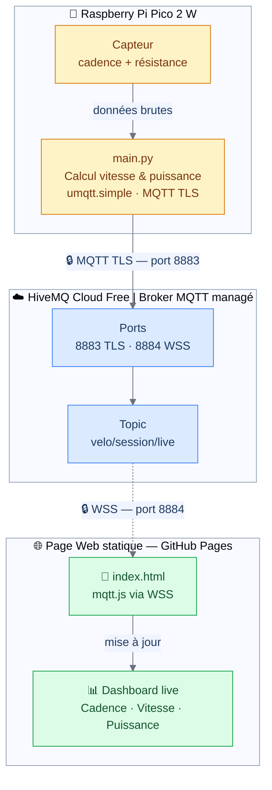

```mermaid
%%{init: {
  'theme': 'base',
  'themeVariables': {
    'primaryColor': '#dbeafe',
    'primaryBorderColor': '#3b82f6',
    'primaryTextColor': '#1e3a5f',
    'lineColor': '#6b7280',
    'edgeLabelBackground': '#f0f4ff',
    'clusterBkg': '#f8faff',
    'clusterBorder': '#94a3b8',
    'fontFamily': 'Segoe UI, sans-serif',
    'fontSize': '15px'
  }
}}%%
graph TB
    subgraph PicoW["🔌 Raspberry Pi Pico 2 W"]
        SENSOR["Capteur<br/>cadence + résistance"]
        CODE["main.py<br/>Calcul vitesse & puissance<br/>umqtt.simple · MQTT TLS"]
    end

    subgraph HiveMQ["☁️ HiveMQ Cloud Free  |  Broker MQTT managé"]
        BROKER["Ports<br/>8883 TLS  ·  8884 WSS"]
        TOPIC["Topic<br/>velo/session/live"]
    end

    subgraph Web["🌐 Page Web statique — GitHub Pages"]
        HTML["📄 index.html<br/>mqtt.js via WSS"]
        UI["📊 Dashboard live<br/>Cadence · Vitesse · Puissance"]
    end

    SENSOR -->|données brutes| CODE
    CODE -->|"🔒 MQTT TLS — port 8883"| BROKER
    BROKER --> TOPIC
    TOPIC -. "🔒 WSS — port 8884" .-> HTML
    HTML -->|mise à jour| UI

    classDef hw fill:#fef3c7,stroke:#d97706,color:#78350f
    classDef cloud fill:#dbeafe,stroke:#3b82f6,color:#1e3a5f
    classDef web fill:#dcfce7,stroke:#16a34a,color:#14532d

    class SENSOR,CODE hw
    class BROKER,TOPIC cloud
    class HTML,UI web

```