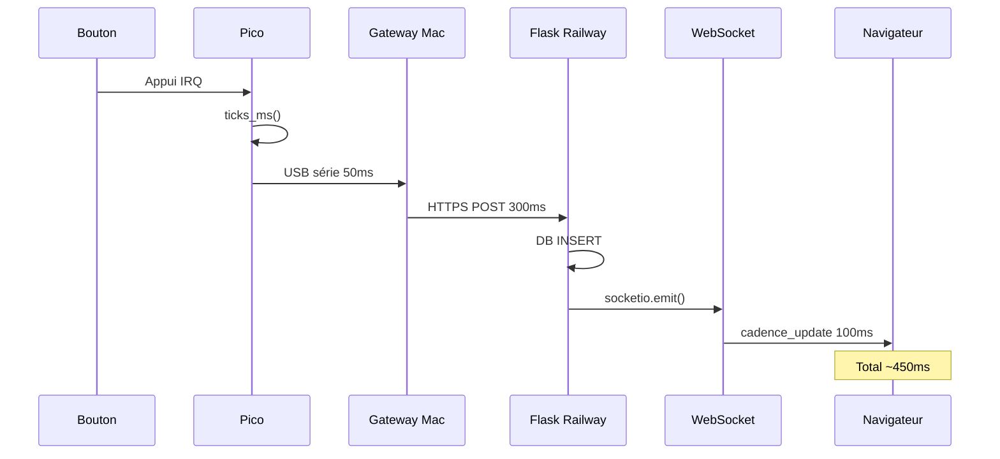

```mermaid
sequenceDiagram
    participant B as Bouton
    participant P as Pico
    participant G as Gateway Mac
    participant F as Flask Railway
    participant W as WebSocket
    participant N as Navigateur
    
    B->>P: Appui IRQ
    P->>P: ticks_ms()
    P->>G: USB série 50ms
    G->>F: HTTPS POST 300ms
    F->>F: DB INSERT
    F->>W: socketio.emit()
    W->>N: cadence_update 100ms
    
    Note over N: Total ~450ms
```