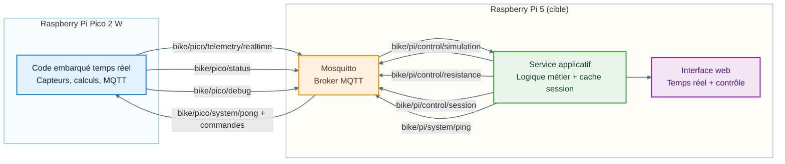

```mermaid
flowchart LR

    subgraph PICO["Raspberry Pi Pico 2 W"]
        A["Code embarqué temps réel<br/>Capteurs, calculs, MQTT"]
    end

    subgraph PI["Raspberry Pi 5 (cible)"]
        B["Mosquitto<br/>Broker MQTT"]
        C["Service applicatif<br/>Logique métier + cache session"]
        D["Interface web<br/>Temps réel + contrôle"]
    end

    A -->|"bike/pico/telemetry/realtime"| B
    A -->|"bike/pico/status"| B
    A -->|"bike/pico/debug"| B

    B --> C
    C --> D

    C -->|"bike/pi/control/simulation"| B
    C -->|"bike/pi/control/resistance"| B
    C -->|"bike/pi/control/session"| B
    C -->|"bike/pi/system/ping"| B
    B -->|"bike/pico/system/pong + commandes"| A

    classDef device fill:#E3F2FD,stroke:#1E88E5,stroke-width:2px,color:#0D253F
    classDef broker fill:#FFF3E0,stroke:#FB8C00,stroke-width:2px,color:#4E342E
    classDef backend fill:#E8F5E9,stroke:#43A047,stroke-width:2px,color:#1B4332
    classDef frontend fill:#F3E5F5,stroke:#8E24AA,stroke-width:2px,color:#4A148C

    class A device
    class B broker
    class C backend
    class D frontend

    style PICO fill:#F8FBFF,stroke:#90CAF9,stroke-width:1.5px
    style PI fill:#FFFDF7,stroke:#B0BEC5,stroke-width:1.5px

    linkStyle default stroke:#546E7A,stroke-width:1.5px
```
